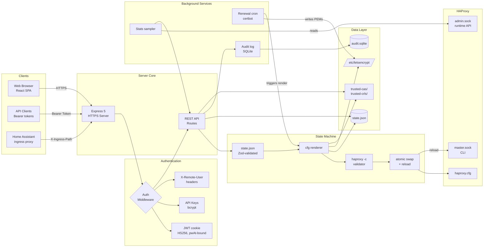

# PatchPanel Architecture

{: .fs-8 }

System architecture of PatchPanel — components, data flow, and the
state-driven render pipeline that produces a running HAProxy
configuration.
{: .fs-6 .fw-300 }

---

## System overview

PatchPanel sits **next to** HAProxy on the same host. It does not proxy
traffic — HAProxy does that. PatchPanel manages HAProxy's configuration:
it renders `haproxy.cfg` from a single canonical state document,
validates the result, atomically replaces the on-disk file, and asks
HAProxy to reload via the master CLI socket. It also handles
certificate lifecycle (Let's Encrypt + bring-your-own), trusted CA / CRL
storage, and live observability via HAProxy's stats socket.

## Architecture diagram

## Component details

### Client layer

- **Web browser** — React 19 SPA. Renders the management UI, polls the
  stats endpoint for live observability, server-sent-events for log
  streaming.
- **API clients** — Anything that holds a bcrypt-issued API key. Billing
  / orchestration systems, CLI tools, monitoring exporters.
- **Home Assistant ingress** — When PatchPanel runs as an HA add-on, HA's
  ingress proxy is the only client. HA performs auth; PatchPanel reads
  `X-Remote-User-*` from the request for audit attribution.

### Authentication

- **Session cookies** (browser admin) — `/api/auth/login` verifies the
  password and issues a stateless JWT (HS256, signed with
  `security.jwtSecret`) in an httpOnly cookie named `patchpanel.sid`.
  The token carries `{sub, username, role, pwAt}` where `pwAt` is the
  user's `passwordChangedAt` timestamp at login time. On every request
  the auth middleware verifies the signature, looks up the user, and
  rejects the token if `pwAt` no longer matches the stored
  `passwordChangedAt` — so `PUT /api/auth/change-password` (which bumps
  `passwordChangedAt`) invalidates every other session for that user.
  There is no server-side session store; JWT signature plus `pwAt`
  comparison are the only state checks.
- **API keys** — bcrypt-hashed Bearer tokens with wire format
  `pp_<8hex-keyId>.<32hex-secret>`. Every token is `role: admin`; scoping
  is not currently differentiated. Optional `expiresAt` and
  `lastUsedAt` are tracked. Mint, list, and revoke via
  `/api/api-tokens`. The plaintext wire string is shown exactly once at
  mint time and never persisted (only its bcrypt hash is stored).
- **HA-ingress mode** — bypasses local auth entirely; trusts HA's
  ingress headers and the supervisor proxy IP whitelist. No first-run
  wizard runs in this mode.

### Server core

- **Express 5** with `helmet`, `cors`, session middleware, `lusca` CSRF
  on cookie-authenticated routes, rate limiting on auth + write
  endpoints.
- **Routes** — REST handlers for state CRUD, cert lifecycle, runtime
  stats, audit history, trusted CAs / CRLs, ACME accounts, and the
  master-socket-level operations (`reload`, `start`, `stop`).

### State machine

This is PatchPanel's core loop. Every write request flows through it:

1. **Validate** — Zod schema check on the incoming candidate state.
2. **Render** — deterministically produce `haproxy.cfg` from the
   candidate state plus the bootstrap config (paths, ports, SSL).
3. **Pre-validate** — write to a temp file, run `haproxy -c -f <tmp>`,
   parse the stderr into structured hints if it fails.
4. **Snapshot** — copy the current `haproxy.cfg` to a `.bak` for
   rollback.
5. **Atomic swap** — `writeAtomic` the rendered cfg to its target path.
6. **Reload** — send `reload` to the master CLI socket. On failure,
   restore the `.bak` and reload again.
7. **Persist state** — only after a successful reload, write the new
   state to disk.
8. **Snapshot history** — append to `/data/snapshots/` for time-machine
   rollback.
9. **Audit** — record the change in the SQLite audit log with editor,
   reason, and a summary of what changed.

### Background services

- **Renewal cron** — Croner-scheduled `certbot renew` runs. Configurable
  per-account schedule, default Mon/Thu 08:05 local time. On success,
  triggers a re-render so the new PEM is picked up by HAProxy's
  `crt-list` reload.
- **Stats sampler** — Polls HAProxy's `admin.sock` every 5s; maintains
  a one-hour rolling window of frontend/backend metrics for dashboard
  charts.
- **Audit log** — Append-only SQLite table, every state mutation
  recorded with actor, category, action, target, outcome, and timestamp.

### Data layer

- **`state.json`** — `/data/state.json` (HA addon) or
  `/var/lib/patchpanel/state.json` (standalone). The single source of
  truth for everything HAProxy-related.
- **`audit.sqlite`** — better-sqlite3, WAL-mode. One table, `audit_log`
  (`ts, actor, category, action, target, details, outcome`), capturing
  every state mutation, auth attempt, runtime op, and cluster event.
  Vacuumed after `logging.auditRetentionDays` (default 365). This
  database stores audit events only — JWTs are stateless and
  invalidated via the `pwAt` claim check (see Authentication above).
- **`/etc/letsencrypt/`** — Certbot's account + cert store, unchanged
  from its standard layout. Symlinks under `live/` are referenced from
  the rendered HAProxy `crt-list`.
- **`trusted-cas/`** + **`trusted-crls/`** — User-uploaded PEM bundles,
  one file per entry, referenced from bind ssl + server lines.

### HAProxy integration

- **`haproxy.cfg`** — The only file HAProxy reads. Generated, never
  hand-edited. PatchPanel's render output is the canonical version.
- **`master.sock`** — HAProxy's master CLI. Used for `reload`,
  start/stop, and configuration introspection.
- **`admin.sock`** — HAProxy's stats / runtime socket. Used for live
  metrics and per-server actions (drain, set weight, etc.) without
  requiring a reload.

### Configuration

- **Bootstrap config** — `/etc/patchpanel/config.yaml`. Paths, ports,
  SSL, auth strategy, log directory. Edited rarely; metadata-wrapped
  YAML drives a generated Settings UI.
- **Runtime state** — `state.json`. The HAProxy data model. Edited
  through the UI on every change.

### Frontend

- **React 19 + Vite + react-bootstrap**. SPA served from the same
  Express server (`web/dist/` static dir + `*splat` fallback).
- **Highcharts** for live charts, **@xyflow/react** for topology, **diff**
  for the rendered-cfg side-by-side view.
- Uses relative asset paths so it renders correctly behind HA's ingress
  subpath as well as at root.

---

**[Back to Home](../)**
